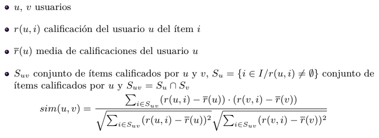
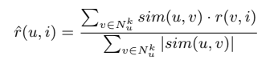
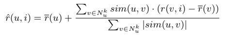

# GCO: Sistemas de recomendación

- **Autor:** Eduardo Da Silva Yanes
- **Asignatura:** Gestión del conocimiento en las organizaciones
- **Centro:** ESIT - Universidad de La Laguna

***

### Objetivo de la práctica:

El objetivo de esta práctica es implementar un sistema de recomendación siguiendo el método de filtrado colaborativo.

### Ejemplo de uso

Para usar el programa debemos ejecutar algo similar a lo siguiente: ```python GCO.py "fichero.txt" pearson 5 simple```

- "fichero.txt" es el fichero donde se encuentra la matriz.
- person es el método usado para calcular la similitud. Las opciones son: pearson, euclidea, coseno
- 5 es el número de vecinos a considerar
- simple es el método de prediccion. Las opciones son: simple y media.

A continuación se muestra un ejemplo de uso respecto al software desarrollado.

```
$python GCO.py matrices_para_probar/matrix_test.txt pearson 3 simple

1. Metrica empleada: pearson
2. Metodo de prediccion: simple
3. Numero de vecinos: 3
---------------------
MATRIZ DE SIMILITUDES
[0] ->  1.0000          0.8528          0.7071          0.0000          -0.7921
[1] ->  0.8528          1.0000          0.4677          0.4900          -0.9001
[2] ->  0.7071          0.4677          1.0000          -0.1612         -0.4666
[3] ->  0.0000          0.4900          -0.1612         1.0000          -0.6415
[4] ->  -0.7921         -0.9001         -0.4666         -0.6415         1.0000
----------------------------------
Vecinos utilizados para calcular Usuario 0 -> Item 4
[(1, 0.8528028654224417), (2, 0.7071067811865475), (4, -0.7921180343813393)]
Resultado prediccion: 2.2542
--- MATRIZ CON LAS PREDICCIONES ---
[0] ->  5.00            3.00            4.00            4.00            2.25
[1] ->  3.00            1.00            2.00            3.00            3.00
[2] ->  4.00            3.00            4.00            3.00            5.00
[3] ->  3.00            3.00            1.00            5.00            4.00
[4] ->  1.00            5.00            5.00            2.00            1.00
```

**ATENCIÓN**: Al utilizar matrices de mayor tamaño es posible que la visualización en la terminal no se la correcta. En esos casos recomiendo redirigir la salida a un fichero de texto y visualizar desde ahí los resultados.

``` python GCO.py "fichero.txt" pearson 5 simple > fichero_salida.txt```

En [este enlace](https://github.com/EduardoSY/GCO2122_Sistema_Recomendacion/tree/main/resultados_matrices) tenemos diversos ficheros de salida de pruebas ejecutadas con el codigo implementado.

### Descripción de la implementación:


1. **Lectura e inicialización de las matrices.**

Lo primero que se hace es leer la matriz y estructurarla de la manera correcta para ser leida y manipulada. Para realizar esto se lee línea a línea en el documento, se procesa y se guarda en un vector. Este vector se inserta a su vez en otro vector, formando así una matriz.

Una vez hecho esto se crea la matriz de similitud. Esta será cuadrada y cuyas dimensiones coinciden, como es lógico, con el número de usuarios. Puesto que aún no se puede calcular los valores lo que se hará será rellenarla de valores vacios.

También se crea un vector donde se almacena qué usuarios tienen algún valor para predecir, es decir, qué usuarios tienen entre sus items un simbolo **-**.


```python
...
linea_fichero = args.file.readlines()
matriz = [] 
usuarios_predecir = [] 
for i in linea_fichero:
    linea = i.split()
    lineaux = []
    necesita_predecir = False
    for j in linea:
        if j != '-':
            aux = int(j)
        else:
            aux = j
            necesita_predecir = True
        lineaux.append(aux)
    if(necesita_predecir == True):
        usuarios_predecir.append(len(matriz))    
    matriz.append(lineaux)

matriz_similitudes = [ [ None for y in range(len(matriz)) ] for x in range( len(matriz)) ] #Matriz de similitud rellena de nada
```

2. **Implementación de métricas**

Con las siguientes funciones podremos calcular la similitud entre un usuario a y un usuario b. En nuestro caso tenemos 3 alternativas.

  1. **Correlación de Pearson**

  

  2. **Distancia coseno**

  

  3. **Distancia euclídea**

  

La implementación consiste simplemente en aplicar la fórmula matemática mostrada en las diapositivas del campus virtual. Es por ello que no considero necesario entrar en mucho detalle. 

Una vez tenemos estas métricas recorremos cada posición de la matriz de similitudes rellenando con los valores correspondientes según la métrica elegida

3. **Calculo de los k-vecinos**

A esta funcion se le pasa como parámetros la métrica empleada, el número de vecinos, el usuario del que vamos a calcular sus vecinos y la posicion (item) que se quiere predecir.

Lo primero es seleccionar la fila de la matriz de similitudes del usuario y ordenarla. Si estamos usando **pearson** o **distancia conseno** nos interesan los valores más altos puesto que estos significan mayor similitud. En el caso de la **distancia euclídea** es lo contrario. 

Una vez hecho esto se valoran los vecinos que **hayan votado** el item que queremos. Si no lo han valorado no lo tenemos en cuenta.

Llegados a este punto se tienen los usuarios que han valorado el item i ordenamos en base a la similitud. Ahora solo se seleccional los necesarios en base al número de vecinos seleccionado.

Con estas operaciones hechas se devuelve un vector que cada elemento es una tupla vecino, similitud.

``` python
def calcular_vecinos(metrica, neighbors, usuario_x, pos_calcular):
    k_vecinos = []
    fila_usuario_ordenar = deepcopy(matriz_similitudes[usuario_x])
    if ((metrica == 'pearson') or (metrica == 'coseno')):
        fila_usuario_ordenar.sort(reverse=True) 
    else:
        fila_usuario_ordenar.sort(reverse=False)

    fila_usuario_limpia = deepcopy(matriz_similitudes[usuario_x])
    
    fila_usuario_limpia2 = deepcopy(fila_usuario_limpia)
    vecinos_coincidentes = []
    
    for elemento in fila_usuario_ordenar:
        usuario = fila_usuario_limpia2.index(elemento)
        fila_usuario_limpia2[usuario] = 0
        if(matriz[usuario][pos_calcular] != '-'): 
            vecinos_coincidentes.append(usuario)

    cantidad_vecinos = vecinos_coincidentes[0:neighbors] 

    for i in cantidad_vecinos:
        valor_similitud = fila_usuario_limpia[i]
        k_vecinos.append((i, valor_similitud))
    print "Vecinos utilizados para calcular Usuario " + str(usuario_x) + " -> Item " + str(pos_calcular)
    print k_vecinos 
    return k_vecinos
```

4. **Realizar la predicción**

Para realizar las predicciones hay dos opciones: predicción simple y diferencia con la media.

De manera análoga a las métricas, en este caso se trata simplemente de implementar las formulas matemáticas presentadas en las diapositivas.

  1. **Predicción simple**

  

  2. **Diferencia con la media**

  

5. **Rellenar la matriz con las predicciones**

Para este último paso se recorre el vector de usuarios a predecir declarado en el apartado 1. Para cada usuario se recorre todos los item buscando cúales hay que predecir y aplicamos el algoritmo de predicción seleccionado.

Finalmente se devuelve la matriz completa.

``` python
for i in usuarios_predecir: #Usuarios de los que tenemos que predecir
  for j in range(len(matriz[i])):  #Recorremos buscando posiciones a predecir
    if (matriz_final[i][j] == '-'): #Encontrada posicion a predecir
      print "----------------------------------"
      k = calcular_vecinos(metrica, vecinos, i, j)
      if(prediccion == "simple"):
          pred  = prediccion_simple(j, k)
          
          print "Resultado prediccion: " + str(pred)
          matriz_final[i][j] = pred
      else:
          
          pred = prediccion_dif_media(i, j, k)
          matriz_final[i][j] = pred

          print "\nResultado prediccion - Usuario " + str(i) + " -> Item " + str(j) + " = " + str(pred) + "\n"
```
